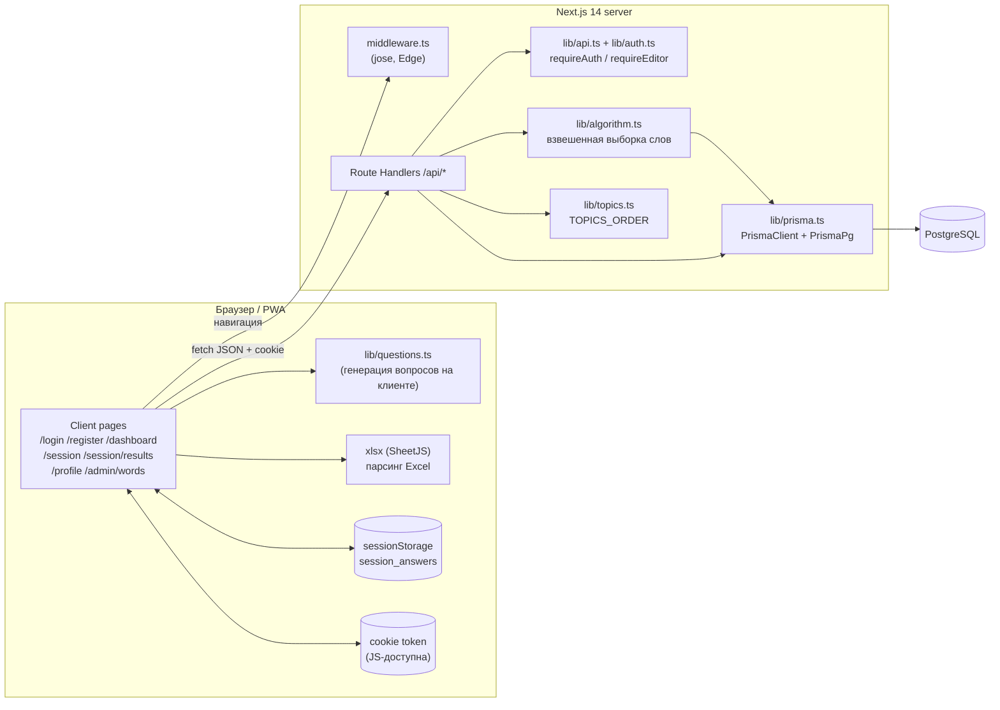
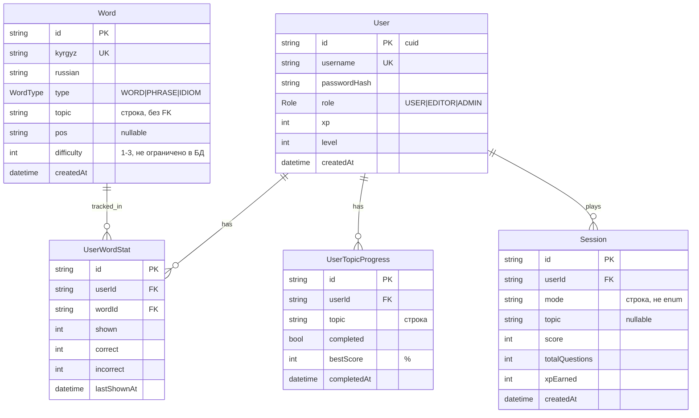

# PROJECT_OVERVIEW — TiliTili Flashcards

> Легенда: ✅ Факт (подтверждено кодом) · 🟡 Предположение · ❓ Неизвестно

## TL;DR

- **Что это:** mobile-first PWA для изучения кыргызских слов (пара кыргызский ↔ русский) по модели Anki-флешкарт. Слова выбираются с учётом весов, есть простая геймификация (XP, уровни, топики, которые открываются по очереди).
- **Стек:** монолит на Next.js 14 (App Router) + TypeScript + Tailwind. API реализован через Route Handlers, данные хранятся в PostgreSQL через Prisma 7 (driver adapter `pg`), авторизация — JWT в cookie.
- **Готовность:** реализованы шаги 1.1–5.3 из 18 по [Developers_roadmap.md](Developers_roadmap.md). Не сделан шаг 5.4 «Деплой» (нет Dockerfile, `vercel.json`, CI). Лендинг `/` пока остаётся шаблоном create-next-app.
- **Главные риски:** токен хранится в cookie, которую пишет JS (без httpOnly). XP считается по данным клиента, и сессию можно «завершить» повторно, начисляя XP снова. Тестов и CI нет. `npm audit` находит 13 уязвимостей, одна из них critical (в `next`).
- **Расхождение с README:** формулы XP и уровней в коде отличаются от описанных в README. Тип вопроса «Б» реализован, но на практике никогда не показывается.

---

## 1. Общее описание

### Назначение
- ✅ Тренировка словарного запаса в паре кыргызский ↔ русский через карточки с выбором ответа ([README.md](README.md), [public/manifest.json](public/manifest.json) — «Кыргызско-русские флешкарты с умным повторением»).
- ✅ Основная платформа — смартфон: PWA (`display: standalone`, `orientation: portrait`), вёрстка mobile-first.
- 🟡 Целевая аудитория — русскоязычные пользователи, которые учат кыргызский: UI полностью на русском, топики названы по-русски, а в README язык описан как «кыргызский и русский».

### Стадия разработки
- ✅ Ранний MVP. Работа идёт по 18 шагам из [Developers_roadmap.md](Developers_roadmap.md). Реализованы шаги 1.1–5.3, шаг 5.4 (деплой) не начат.
- ✅ Все реализованные шаги слиты в `main` (merge-коммит `3325eb6`, PR #3–#8). Шаги 1.2–4.2 в истории схлопнуты в один коммит `message` (`c2cb969`).
- ✅ `tsc --noEmit` проходит без ошибок. `next lint` выдаёт 1 warning (a11y, `aria-sort` на `<button>` в [src/app/admin/words/page.tsx](src/app/admin/words/page.tsx#L170)).

### Пользовательские сценарии, которые уже есть в коде
| # | Сценарий | Путь в UI | Файлы |
|---|---|---|---|
| 1 | Регистрация (username + пароль, без email) → автологин → dashboard | `/register` | [src/app/register/page.tsx](src/app/register/page.tsx), [src/app/api/auth/register/route.ts](src/app/api/auth/register/route.ts) |
| 2 | Вход / выход | `/login`, кнопка «Выйти» в профиле | [src/app/login/page.tsx](src/app/login/page.tsx), [src/app/profile/page.tsx](src/app/profile/page.tsx) |
| 3 | Быстрая сессия: режим (случайные / повторение / слабые места) и направление (КЫР→РУС / РУС→КЫР) | `/dashboard` → bottom sheet → `/session?mode=…&direction=…` | [src/app/dashboard/page.tsx](src/app/dashboard/page.tsx), [src/app/session/page.tsx](src/app/session/page.tsx) |
| 4 | Прохождение топика-уровня; следующий открывается при результате ≥ 75 % | `/dashboard` → карточка топика → `/session?mode=topic&topic=…` | [src/app/api/topics/route.ts](src/app/api/topics/route.ts), [src/app/api/session/finish/route.ts](src/app/api/session/finish/route.ts) |
| 5 | Ответ на вопрос → подсветка правильного и неправильного варианта → «Далее» → экран результатов (%, XP, level-up, список ошибок, «Ещё раз») | `/session` → `/session/results` | [src/app/session/results/page.tsx](src/app/session/results/page.tsx), [src/components/quiz/QuestionCard.tsx](src/components/quiz/QuestionCard.tsx) |
| 6 | Профиль: звание, XP, статистика, пройденные топики | `/profile` | [src/app/profile/page.tsx](src/app/profile/page.tsx), [src/app/api/profile/route.ts](src/app/api/profile/route.ts) |
| 7 | Админка словаря: таблица с фильтрами, поиском, сортировкой и пагинацией, CRUD | `/admin/words` (EDITOR/ADMIN) | [src/app/admin/words/page.tsx](src/app/admin/words/page.tsx), [src/components/admin/WordForm.tsx](src/components/admin/WordForm.tsx) |
| 8 | Импорт слов из Excel/CSV: парсинг на клиенте → проверка дублей → подтверждение | `/admin/words` → «Импорт Excel» | [src/components/admin/ImportModal.tsx](src/components/admin/ImportModal.tsx), [src/app/api/words/import/route.ts](src/app/api/words/import/route.ts) |

---

## 2. Технологический стек

| Слой | Технология | Версия | Где определено |
|---|---|---|---|
| Фреймворк (FE + BE) | Next.js, App Router | 14.2.35 (зафиксирована) | [package.json](package.json) |
| UI | React / React DOM | ^18 | package.json |
| Язык | TypeScript (`strict: true`) | ^5 | package.json, [tsconfig.json](tsconfig.json) |
| Стили | Tailwind CSS + PostCSS | ^3.4.1 / ^8 | [tailwind.config.ts](tailwind.config.ts), [postcss.config.mjs](postcss.config.mjs) |
| Шрифты | Geist / Geist Mono (локально, `next/font/local`) | — | [src/app/layout.tsx](src/app/layout.tsx) |
| БД | PostgreSQL | ❓ версия не указана | [prisma/schema.prisma](prisma/schema.prisma), [.env.example](.env.example) |
| ORM / миграции | Prisma + `@prisma/adapter-pg` + `pg` | 7.8.0 / ^8.21 | package.json, [prisma.config.ts](prisma.config.ts), [src/lib/prisma.ts](src/lib/prisma.ts) |
| Хеширование паролей | bcryptjs (cost 10) | ^3.0.3 | [src/lib/auth.ts](src/lib/auth.ts) |
| JWT (Node runtime) | jsonwebtoken (HS256, TTL 7d) | ^9.0.3 | src/lib/auth.ts |
| JWT (Edge middleware) | jose | ^6.2.10 | [src/middleware.ts](src/middleware.ts) |
| Парсинг Excel | xlsx (SheetJS), на клиенте | ^0.18.5 | [src/components/admin/ImportModal.tsx](src/components/admin/ImportModal.tsx) |
| Env | dotenv (для Prisma CLI и seed) | ^17.4.2 | prisma.config.ts, prisma/seed.ts |
| Seed-раннер | ts-node | ^10.9.2 | package.json, [tsconfig.seed.json](tsconfig.seed.json) |
| Линтер | ESLint + `next/core-web-vitals`, `next/typescript` | ^8 / 14.2.35 | [.eslintrc.json](.eslintrc.json) |
| PWA | Web App Manifest, без Service Worker | — | public/manifest.json, [next.config.mjs](next.config.mjs) |
| Кэш, очереди | — нет | — | — |
| Тесты | — нет | — | — |
| CI/CD | — нет (`.github/` отсутствует) | — | — |
| Хостинг | 🟡 Vercel + Railway (план, в коде конфигов нет) | — | README.md, Developers_roadmap.md (шаг 5.4) |
| Node.js | ❓ не зафиксирован (нет `engines` и `.nvmrc`); локально v26 | — | — |

---

## 3. Архитектура

### Стиль
- ✅ **Монолит на Next.js**: UI и API в одном приложении, один репозиторий, один пакет (не монорепо).
- ✅ **Рендеринг:** все экраны — Client Components (`"use client"`), данные загружаются через `fetch` в `useEffect`. По сути это SPA поверх App Router. SSR и Server Components для данных не используются.
- ✅ **Backend:** Route Handlers в `src/app/api/**/route.ts`, Prisma вызывается прямо в обработчиках. Отдельных слоёв service/repository нет, кроме `src/lib/algorithm.ts`.
- ✅ **Edge middleware** проверяет JWT (через jose) для страниц. API-роуты middleware не покрывает, они сами вызывают `requireAuth` / `requireEditor`.

### Диаграмма компонентов



### Поток данных (на примере учебной сессии)
1. ✅ `/dashboard` → `router.push("/session?mode=…&topic=…&direction=…")`. Middleware проверяет cookie `token`; если токена нет, перенаправляет на `/login`.
2. ✅ `POST /api/session/start {mode, topic}` → `requireAuth` → `getWordsForSession()` загружает **все** слова (или слова топика) вместе с `UserWordStat` текущего пользователя, назначает веса и делает взвешенную выборку без возвращения → создаётся запись `Session` → в ответе `{sessionId, words}` (слова сразу с переводами).
3. ✅ Клиент строит вопросы локально (`generateQuestion`) и **сам** определяет, верен ли ответ (`option === q.correctAnswer`).
4. ✅ На каждый ответ отправляется `POST /api/session/answer {wordId, sessionId, answer}`: сервер выполняет upsert в `UserWordStat` (shown/correct/incorrect/lastShownAt) и возвращает правильный ответ.
5. ✅ После последнего вопроса ответы сохраняются в `sessionStorage` → `/session/results` → `POST /api/session/finish {sessionId, answers:[{wordId,isCorrect}]}`. Сервер считает XP **по присланным клиентом `isCorrect`**, обновляет `Session`, `User.xp/level` и `UserTopicProgress` → результат отображается на экране.

---

## 4. Структура репозитория

```
tilitili-flashcards/
├── prisma/
│   ├── schema.prisma           # 5 моделей, 2 enum
│   ├── migrations/             # 2 миграции (init, add_session_topic)
│   └── seed.ts                 # ~240 слов в 20 топиках + пользователь admin
├── public/
│   ├── manifest.json           # PWA-манифест
│   ├── apple-touch-icon.png
│   └── icons/                  # 192, 512, maskable-512
├── src/
│   ├── middleware.ts           # защита страниц (JWT через jose)
│   ├── app/                    # App Router: страницы + API
│   │   ├── layout.tsx          # корневой layout, PWA-метатеги
│   │   ├── page.tsx            # «/» — шаблон create-next-app (заглушка)
│   │   ├── error.tsx, global-error.tsx, not-found.tsx
│   │   ├── login/, register/, dashboard/, profile/
│   │   ├── session/            # экран сессии + results/
│   │   ├── admin/words/        # управление словарём
│   │   └── api/                # auth/, words/, session/, topics/, profile/
│   ├── components/
│   │   ├── ui/                 # Modal, Skeleton
│   │   ├── quiz/               # QuestionCard
│   │   └── admin/              # WordForm, ImportModal
│   ├── lib/                    # prisma, auth, api (guards), algorithm,
│   │                           # questions, topics, levels
│   └── types/                  # пустая, в git не отслеживается
├── Developers_roadmap.md       # план из 18 шагов (промпты для Claude Code)
├── CHEATSHEET.md               # шпаргалка по локальному запуску
├── CLAUDE.md                   # правила для AI-ассистента
└── README.md                   # продуктовое описание
```

### Точки входа
- ✅ Приложение: `next dev` / `next start` → [src/app/layout.tsx](src/app/layout.tsx).
- ✅ Middleware: [src/middleware.ts](src/middleware.ts), `matcher`: `/dashboard`, `/session`, `/profile`, `/admin`, `/login`, `/register`.
- ✅ Seed: [prisma/seed.ts](prisma/seed.ts) (`npm run seed` / `npx prisma db seed`).
- ✅ PWA `start_url`: `/dashboard`.

### Соглашения
- ✅ Импорты через алиас `@/*` → `src/*` (tsconfig.json).
- ✅ Компоненты в PascalCase. В основном используется default export, но `QuestionCard` и `Skeleton` экспортируются по имени — единого стиля нет.
- ✅ API: один `route.ts` на ресурс, ответы в JSON, тексты ошибок на русском в поле `error`.
- ✅ Для каждого основного экрана есть `loading.tsx` со скелетоном (dashboard, profile, admin/words).
- ✅ Сообщения коммитов — `Step X.Y: …` или conventional commits (`fix(admin): …`, `refactor: …`).
- 🟡 README описывает route groups `(auth)/(app)` и файл `lib/db.ts`, но в коде их нет: структура в README устарела.

---

## 5. Функциональность

| Модуль / фича | Описание | Статус | Файлы |
|---|---|---|---|
| Регистрация / вход | username ≥ 3, пароль ≥ 6, bcrypt, JWT на 7 дней | ✅ готово | api/auth/*, login/, register/ |
| Выход | очистка cookie на клиенте | ✅ готово | profile/page.tsx |
| Защита роутов | middleware для страниц, guards для API | ✅ готово | middleware.ts, lib/api.ts |
| Выборка слов («умный повтор») | веса: ошибки > 40 % → ×2; новые → ×1.5; не показывались > 7 дней → ×1.5; усвоенные → ×0.5; режимы random/repeat/weak/topic | ✅ готово | lib/algorithm.ts |
| Вопрос типа A (4 варианта) | дистракторы берутся из того же топика | ✅ готово (дистракторы только из слов текущей сессии) | lib/questions.ts |
| Вопрос типа B (2 похожих) | срабатывает при `shownCount > 0` | 🟡 **код есть, но не используется**: клиент вызывает `generateQuestion` без `shownCount` ([session/page.tsx:76](src/app/session/page.tsx#L76)), а API не возвращает статистику | lib/questions.ts |
| Направление перевода | ky-ru / ru-ky | ✅ готово (параметр `direction`, отправляемый в `/api/session/start`, сервер игнорирует) | session/page.tsx |
| Экран сессии | прогресс-бар, фидбек, подтверждение выхода | ✅ готово | session/page.tsx, components/quiz/QuestionCard.tsx |
| Результаты сессии | %, XP, баннер level-up, список ошибок, «Ещё раз» | ✅ готово (без анимации и без названия звания при level-up) | session/results/page.tsx |
| XP и уровни | 10 XP за правильный ответ и +5 за каждые 3 подряд; `level = floor(xp/100)+1`, не выше 99 | ✅ готово, но **расходится с README** (бонусы за сессию и топик, 10 уровней с нелинейными порогами) | api/session/finish/route.ts, lib/levels.ts |
| Звания | Новичок (1) / Ученик (5) / Продвинутый (10) / Знаток (15) / Мастер (20) | ✅ готово (только в профиле), расходится с README | lib/levels.ts |
| Прогрессия топиков | 20 топиков по порядку; первый открыт; следующий открывается при ≥ 75 % | ✅ готово | lib/topics.ts, api/topics/* |
| Dashboard | приветствие, уровень и XP, быстрая сессия, список топиков | ✅ готово (звание не выводится) | dashboard/page.tsx |
| Профиль | инициалы, звание, XP, 4 метрики, пройденные топики | ✅ готово | profile/page.tsx, api/profile |
| Админка словаря | таблица, фильтры (топик/тип), поиск, сортировка, пагинация по 50, CRUD | ✅ готово (фильтр по `difficulty` есть в API, но не в UI) | admin/words/page.tsx, api/words/* |
| Импорт Excel/CSV | SheetJS на клиенте, preview → confirm, дубли по `kyrgyz` | ✅ готово | ImportModal.tsx, api/words/import |
| Seed словаря | ~240 слов, 20 топиков, авто-оценка type/difficulty, пользователь admin | ✅ готово | prisma/seed.ts |
| PWA | manifest, иконки, метатеги | ✅ готово (без Service Worker, офлайна нет) | manifest.json, layout.tsx |
| Error boundary / 404 / скелетоны | | ✅ готово | error.tsx, global-error.tsx, not-found.tsx, */loading.tsx |
| Лендинг `/` | для гостей | ❌ **заглушка** (шаблон create-next-app со ссылками на Vercel) | src/app/page.tsx |
| Управление пользователями (ADMIN) | заявлено в README | ❌ отсутствует; права ADMIN и EDITOR совпадают | — |
| Деплой (шаг 5.4) | Dockerfile, vercel.json, инструкция | ❌ не начато | — |

---

## 6. API

Авторизация: cookie `token` или заголовок `Authorization: Bearer <jwt>` ([src/lib/api.ts](src/lib/api.ts)).

| Метод | Путь | Назначение | Auth | Обработчик |
|---|---|---|---|---|
| POST | `/api/auth/register` | Создать пользователя, вернуть `{token}` (201) | — | [api/auth/register/route.ts](src/app/api/auth/register/route.ts) |
| POST | `/api/auth/login` | Проверить пароль, вернуть `{token}` | — | [api/auth/login/route.ts](src/app/api/auth/login/route.ts) |
| GET | `/api/auth/me` | Текущий пользователь `{user}` | USER+ | [api/auth/me/route.ts](src/app/api/auth/me/route.ts) |
| GET | `/api/profile` | `{user, stats, completedTopics}` | USER+ | [api/profile/route.ts](src/app/api/profile/route.ts) |
| GET | `/api/topics` | Топики со счётчиком слов и статусом `available/locked/completed` | USER+ | [api/topics/route.ts](src/app/api/topics/route.ts) |
| GET | `/api/topics/[topic]/status` | Статус одного топика | USER+ | [api/topics/[topic]/status/route.ts](src/app/api/topics/[topic]/status/route.ts) |
| POST | `/api/session/start` | `{mode, topic?, count?≤50}` → `{sessionId, words}` | USER+ | [api/session/start/route.ts](src/app/api/session/start/route.ts) |
| POST | `/api/session/answer` | `{wordId, sessionId, answer}` → `{isCorrect, correctAnswer, stat}` | USER+ (проверяет, что сессия принадлежит пользователю) | [api/session/answer/route.ts](src/app/api/session/answer/route.ts) |
| POST | `/api/session/finish` | `{sessionId, answers[]}` → XP, уровень, прогресс топика | USER+ | [api/session/finish/route.ts](src/app/api/session/finish/route.ts) |
| GET | `/api/words` | Список: `topic, type, difficulty, search, page, sort, order` | EDITOR/ADMIN | [api/words/route.ts](src/app/api/words/route.ts) |
| POST | `/api/words` | Создать слово (409 при дубле `kyrgyz`) | EDITOR/ADMIN | api/words/route.ts |
| PUT | `/api/words/[id]` | Частичное обновление | EDITOR/ADMIN | [api/words/[id]/route.ts](src/app/api/words/[id]/route.ts) |
| DELETE | `/api/words/[id]` | Удаление (каскадом удаляется статистика) | EDITOR/ADMIN | api/words/[id]/route.ts |
| POST | `/api/words/import[?confirm=true]` | `{words[]}` → preview с дублями или `createMany` | EDITOR/ADMIN | [api/words/import/route.ts](src/app/api/words/import/route.ts) |

### Формат ответов и ошибок
- ✅ Успешный ответ — JSON-объект, обычно обёрнутый в поле (`{user}`, `{word}`, `{words,total,page,pageSize}`), иногда «плоский» (`/finish`, `/topics/[topic]/status`). Единого конверта нет.
- ✅ Ошибка — `{ "error": "<текст на русском>" }` со статусами 400 / 401 / 403 / 404 / 409.
- ✅ Нет глобального try/catch и логирования в API: ошибка Prisma превращается в стандартный ответ Next 500 (HTML или пустое тело).
- ✅ Валидация ручная (проверки `!body?.x`). Схем (zod и т. п.) нет, типы и диапазоны (`difficulty 1–3`, `type` ∈ enum) не проверяются.
- ✅ OpenAPI / Swagger **отсутствует**.

---

## 7. Модель данных

✅ Источник: [prisma/schema.prisma](prisma/schema.prisma).



- ✅ Уникальные ключи: `User.username`, `Word.kyrgyz`, `(userId, wordId)`, `(userId, topic)`. Все FK с `ON DELETE CASCADE`.
- ✅ Топик — **строка**, отдельной таблицы нет. Порядок топиков и их набор задаются в коде ([src/lib/topics.ts](src/lib/topics.ts)), значит переименование топика «потеряет» прогресс пользователей.
- ✅ Ответы по отдельным вопросам не хранятся (таблицы Answer нет): есть только агрегаты в `UserWordStat` и итог в `Session`.
- ✅ Нет индексов на `Session.userId`, `Word.topic`, `UserTopicProgress.userId` (кроме составных unique). На текущем объёме это некритично.
- ✅ Миграции: 2 шт. — `20260605091537_init`, `20260915161045_add_session_topic`; они соответствуют схеме.
- 🟡 [CHEATSHEET.md](CHEATSHEET.md) советует `prisma db push`, а README — `prisma migrate dev`. Два разных процесса работы со схемой могут привести к дрейфу между схемой и миграциями.
- ✅ Генератор `prisma-client-js`. В `.gitignore` есть `/src/generated/prisma` — остаток от генератора `prisma-client`, сейчас не используется.

---

## 8. Аутентификация и безопасность

### Механизм
- ✅ Пароли хешируются bcrypt (10 раундов). JWT HS256 содержит `{userId, role}` и живёт 7 дней ([src/lib/auth.ts](src/lib/auth.ts)).
- ✅ Сервер возвращает токен в JSON, а клиент сам записывает его в cookie через `document.cookie` ([login/page.tsx:30](src/app/login/page.tsx#L30), [register/page.tsx:43](src/app/register/page.tsx#L43)). **Cookie без `HttpOnly`, `Secure` и явного `SameSite`**. Roadmap (шаг 1.4) требовал httpOnly.
- ✅ Выход только очищает cookie на клиенте. Отзыва токенов нет.
- ✅ Авторизация по ролям: `requireEditor` пускает EDITOR и ADMIN. Отдельных прав для ADMIN нет.
- ✅ Роль хранится в JWT: после понижения роли старый токен остаётся валидным до 7 дней.

### Переменные окружения ([.env.example](.env.example))
| Переменная | Назначение | Где используется |
|---|---|---|
| `DATABASE_URL` | подключение к PostgreSQL | src/lib/prisma.ts, prisma.config.ts, seed.ts |
| `JWT_SECRET` | подпись JWT | src/lib/auth.ts, src/middleware.ts |
| `NEXT_PUBLIC_APP_URL` | базовый URL | ❓ объявлена, но **в коде не используется** |
| `SEED_ADMIN_PASSWORD` | пароль admin в seed (по умолчанию `admin123`) | prisma/seed.ts — **не указана в .env.example** |

- ✅ `.env` в `.gitignore` и в git не попадал (`git ls-files` его не содержит).
- ✅ Наличие переменных не проверяется при старте: везде используется `process.env.X!`, и без `JWT_SECRET` ошибка возникнет только во время запроса.

### Замеченные риски
1. ✅ **Подделка XP:** `/api/session/finish` берёт `isCorrect` из тела запроса. Можно прислать любые ответы и получить XP и пройденный топик.
2. ✅ **Повторное начисление:** у `Session` нет признака «завершена», поэтому `finish` для одного `sessionId` можно вызывать сколько угодно раз.
3. ✅ **Токен доступен JS** (cookie без httpOnly), так что при любой XSS его можно украсть.
4. ✅ **Seed создаёт admin/admin123**, если не задан `SEED_ADMIN_PASSWORD`. На проде это готовый админ-доступ.
5. ✅ Нет rate limiting на `/api/auth/login` и `/register`, поэтому возможен перебор паролей.
6. ✅ `/api/session/answer` засчитывает ответ, совпадающий с **любым** из двух переводов. API не проверяет, что `wordId` входит в сессию.
7. ✅ Нет валидации длины и формата полей: username без ограничения длины и набора символов, а импорт принимает массив любого размера без лимита.
8. ✅ `npm audit --omit=dev`: **13 уязвимостей (1 critical, 9 high, 3 moderate)**. Critical — в `next@14.2.35`. У `xlsx@0.18.5` с npm high-уязвимость (prototype pollution / ReDoS), и на npm у неё нет фикса.
9. 🟡 CSRF: проверки Origin нет. Частично защищают дефолт браузера `SameSite=Lax` и JSON-тело, но явной защиты нет.
10. ✅ CORS не настраивается (политика Next по умолчанию — same-origin). Это нормально.

---

## 9. Инфраструктура и окружения

### Локальный запуск (по [README.md](README.md) и [CHEATSHEET.md](CHEATSHEET.md))
1. Установить PostgreSQL и создать БД ❓ (docker-compose нет, версия не указана).
2. `npm install`
3. `cp .env.example .env` и заполнить `DATABASE_URL`, `JWT_SECRET`.
4. `npx prisma migrate dev` — применить миграции и сгенерировать клиент.
5. `npx prisma db seed` (или `npm run seed`) — загрузить словарь и admin.
6. `npm run dev` → http://localhost:3000. Вход: `admin` / `admin123` (или `SEED_ADMIN_PASSWORD`).

### Сборка, деплой, CI/CD
- ✅ Скрипты: `dev`, `build`, `start`, `lint`, `seed` ([package.json](package.json)).
- ✅ Seed-команда описана в двух местах: `package.json → prisma.seed` и `prisma.config.ts → migrations.seed`. 🟡 В Prisma 7 используется только вторая, первая — мёртвая конфигурация.
- ✅ Dockerfile, docker-compose, `vercel.json` **отсутствуют**.
- ✅ CI/CD **отсутствует** (нет `.github/workflows`).
- 🟡 Планируется Vercel (приложение) + Railway (PostgreSQL) — из README и roadmap 5.4.
- ✅ Заголовки для `/manifest.json` и `/icons/*` настроены в [next.config.mjs](next.config.mjs).

### Окружения
- ❓ dev / stage / prod не определены. Есть только одно `.env`. Ветка `origin/dev` существует, но устарела: в ней 2 коммита, кода нет.

---

## 10. Качество кода

### Тесты
- ✅ **Тестов нет**: ни unit, ни e2e, ни тестового фреймворка в зависимостях. Покрытие — 0 %.
- 🟡 Лучшие кандидаты на unit-тесты — чистые функции `generateQuestion`, `calcXP`/`calcLevel`, расчёт статусов топиков и весов в `getWordsForSession`.

### Линтеры, форматтеры, типизация
- ✅ ESLint (`next/core-web-vitals` + `next/typescript`): 1 warning.
- ✅ TypeScript `strict`, `tsc --noEmit` проходит без ошибок.
- ✅ Prettier, EditorConfig, pre-commit хуков (husky / lint-staged) нет.
- ✅ Пакеты `@types/*` лежат в `dependencies` вместо `devDependencies`.

### Наблюдаемость
- ✅ Логирование: `console.error` только в error boundaries ([error.tsx](src/app/error.tsx), [global-error.tsx](src/app/global-error.tsx)). В API логов нет.
- ✅ Мониторинга и трекинга ошибок (Sentry и т. п.), healthcheck-эндпоинта нет.
- ✅ На клиенте ошибки обрабатываются: показываются сообщения, есть fallback-экраны. Но в `/dashboard` при ошибке `/api/topics` возможно падение на `topics.map`, если тело ответа не содержит `topics`.

---

## 11. Технический долг и риски

| Проблема | Где | Влияние | Рекомендация |
|---|---|---|---|
| XP и прохождение топика считаются по данным клиента; `finish` можно вызвать повторно | api/session/finish/route.ts | Высокое | Хранить ответы на сервере (таблица `SessionAnswer` или сверка с `UserWordStat`), добавить `Session.finishedAt` и отклонять повторный вызов |
| JWT в JS-cookie без httpOnly/Secure/SameSite | login/, register/, profile/ | Высокое | Ставить cookie на сервере через `NextResponse.cookies.set({httpOnly, secure, sameSite:'lax'})`; выход сделать через `POST /api/auth/logout` |
| Уязвимости в зависимостях (critical в next, xlsx без фикса) | package.json | Высокое | Обновить `next` до последнего патча 14.x или мигрировать на 15; взять `xlsx` с CDN SheetJS (0.20+) или перейти на `exceljs` / `papaparse` |
| Дефолтный admin/admin123 в seed | prisma/seed.ts:177 | Высокое (для прода) | Требовать `SEED_ADMIN_PASSWORD` и падать, если не задан; добавить переменную в .env.example |
| Нет тестов и CI | весь репозиторий | Высокое | Vitest для `lib/*` и API; GitHub Actions: lint + tsc + test + build |
| Логика XP/уровней/званий расходится с README; `100` захардкожено в 3 местах | finish/route.ts, lib/levels.ts, dashboard/page.tsx:37, session/results/page.tsx:124 | Среднее | Решить, какая модель верна; держать формулы в одном месте `lib/levels.ts` |
| Тип вопроса B фактически не работает | session/page.tsx:76, api/session/start | Среднее | Отдавать `shown` из `/session/start` и передавать в `generateQuestion` |
| Дистракторы только из слов текущей сессии; при < 4 словах появляются варианты вида «слово?» | lib/questions.ts | Среднее | Отдавать с сервера пул дистракторов из топика или всего словаря |
| Список топиков продублирован в 4 местах в разном порядке | lib/topics.ts, admin/words/page.tsx:18, WordForm.tsx:20, dashboard (иконки) | Среднее | Один источник — `lib/topics.ts` (имена, порядок, иконки) |
| Нет валидации входных данных и централизованной обработки ошибок | все api/* | Среднее | zod-схемы + общий хелпер с try/catch и логированием |
| `getWordsForSession` загружает весь словарь в память на каждый старт | lib/algorithm.ts | Низкое (сейчас ~240 слов) | При росте словаря фильтровать или сэмплировать в SQL |
| Нет транзакции в `finish` (3–4 последовательные записи) | api/session/finish/route.ts | Низкое | `prisma.$transaction` |
| Лендинг `/` — шаблон Next.js | src/app/page.tsx | Низкое (UX, но первое впечатление) | Сделать лендинг или редирект на `/dashboard` / `/login` |
| Топик — строка без справочника; нет индексов по FK | prisma/schema.prisma | Низкое | Модель `Topic` (id, name, order, icon) при следующей миграции |
| Две JWT-библиотеки (jsonwebtoken + jose) | lib/auth.ts, middleware.ts | Низкое | Оставить только `jose` (работает и в Edge, и в Node) |
| Неиспользуемое: `NEXT_PUBLIC_APP_URL`, `/src/generated/prisma` в .gitignore, `package.json → prisma.seed`, пустая `src/types` | разное | Низкое | Удалить или задействовать |
| Документация устарела (структура в README, `db push` в CHEATSHEET) | README.md, CHEATSHEET.md | Низкое | Обновить вместе с шагом 5.4 |
| Нет фиксации версии Node | package.json | Низкое | `engines.node` + `.nvmrc` |

---

## 12. Открытые вопросы

1. ❓ Какая модель XP и уровней правильная: из README (бонусы за сессию и топик, 10 уровней с порогами 0…4000) или из кода (10 XP за ответ, линейно по 100 XP, до 99 уровней)?
2. ❓ Какие звания и пороги верные — из README (10 званий) или из `lib/levels.ts` (5 званий)?
3. ❓ Нужна ли роль ADMIN с отдельными правами (управление пользователями, как в README) или EDITOR = ADMIN — осознанное упрощение MVP?
4. ❓ Целевая платформа деплоя и окружения: подтверждается ли Vercel + Railway, нужны ли stage и preview?
5. ❓ Версия PostgreSQL и Node.js для прода?
6. ❓ Назначение `NEXT_PUBLIC_APP_URL` (сейчас не используется)?
7. ❓ Должен ли `/` быть публичным лендингом (README: «Гость — просмотр лендинга») и что на нём должно быть?
8. ❓ Нужен ли офлайн-режим PWA (Service Worker) или достаточно установки на домашний экран?
9. ❓ Источник словаря и лицензия контента (откуда ~240 слов в seed, кто проверяет переводы)?
10. ❓ Планируется ли публичная регистрация на проде — от этого зависят приоритет rate limiting и антиспама?
11. ❓ Судьба ветки `origin/dev`: удалить или использовать как integration-ветку?

---

## 13. Рекомендации на ближайший этап

1. **Закрыть читерство с XP.** Сервер сам определяет правильность ответа (сохранять ответы сессии), `Session.finishedAt` защищает от повторного `finish`, запись делается в одной транзакции.
2. **Перенести cookie на сервер.** `register` и `login` ставят httpOnly + Secure + SameSite cookie, добавить `POST /api/auth/logout`. Обязательно сделать до публичного деплоя.
3. **Обновить зависимости.** Патч `next`, замена или обновление `xlsx`, `npm audit` без critical и high.
4. **Минимальный CI.** GitHub Actions на PR: `npm ci` → `lint` → `tsc --noEmit` → `test` → `build`.
5. **Первые тесты (Vitest).** `questions.ts`, расчёт XP и уровня (после выноса в `lib/levels.ts`), статусы топиков, веса в `algorithm.ts`.
6. **Один источник правды для игровой логики.** Утвердить с владельцем модель XP и званий (вопросы 1–2), вынести константы и топики в `lib/`, обновить README.
7. **Валидация и ошибки API.** zod-схемы для тел запросов, общий обработчик с логированием, лимиты на длину полей и размер импорта; rate limit на auth.
8. **Безопасный seed и env.** Обязательный `SEED_ADMIN_PASSWORD`, проверка env при старте, актуальный `.env.example`.
9. **Шаг 5.4 + лендинг.** `vercel.json` или Dockerfile, инструкция по деплою, `engines.node`; заменить шаблонный `/`.

---

_Дата анализа: 2026-10-03 · ветка `main` · коммит `3325eb6` (содержимое идентично `a15080f`)_
